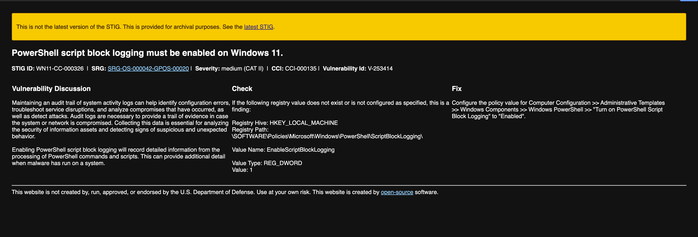
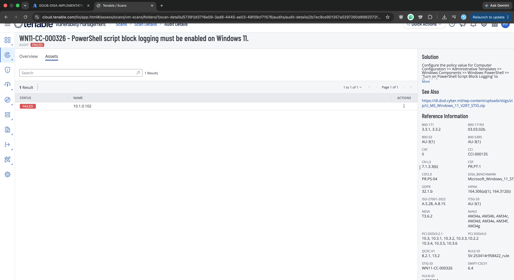
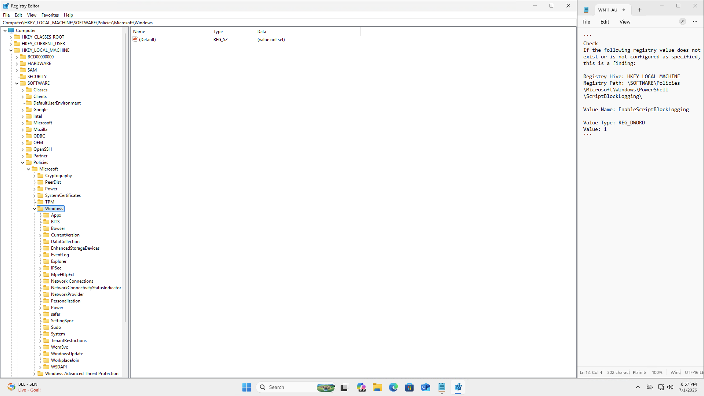
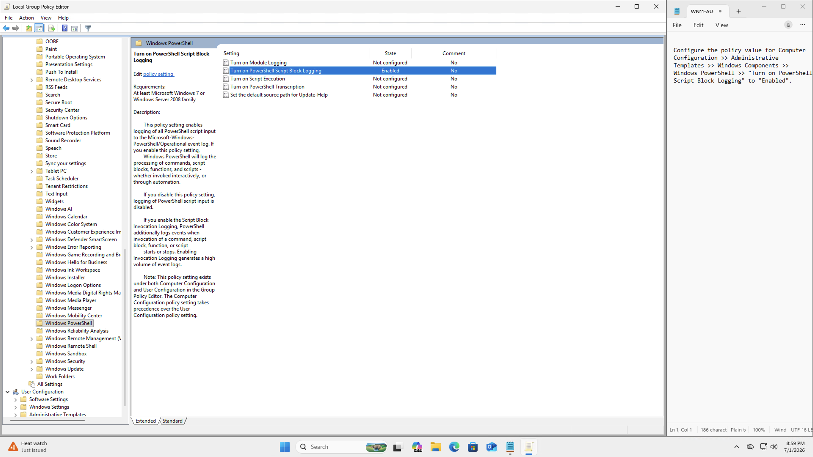
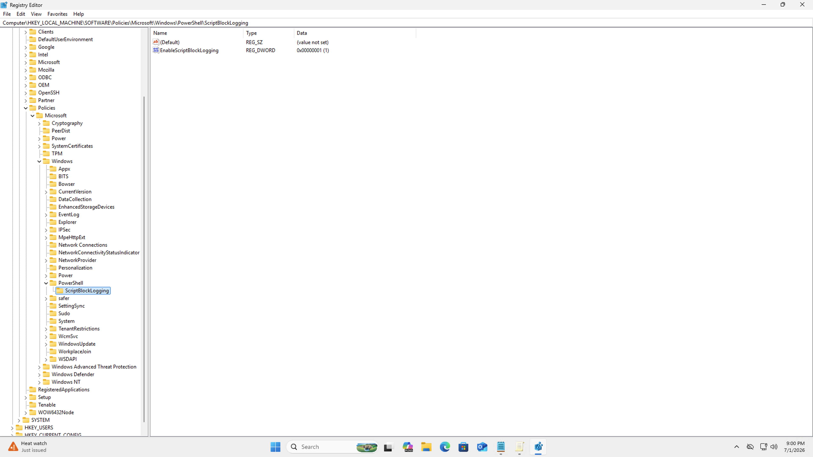
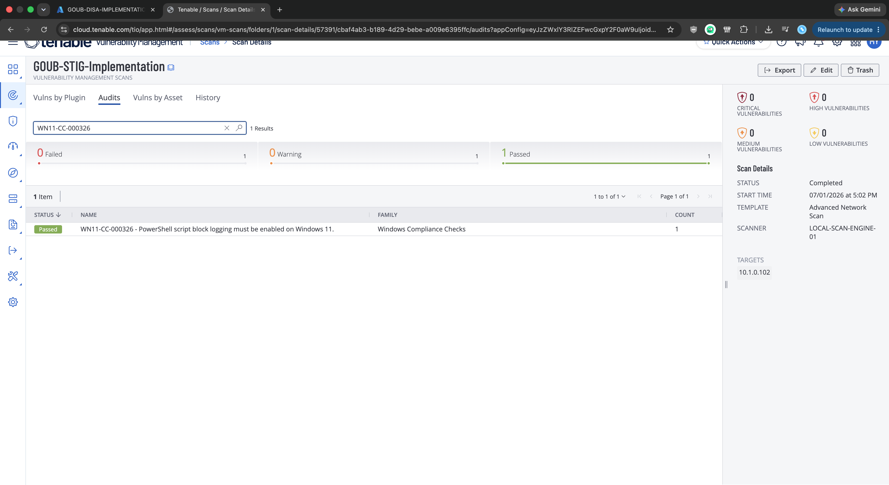
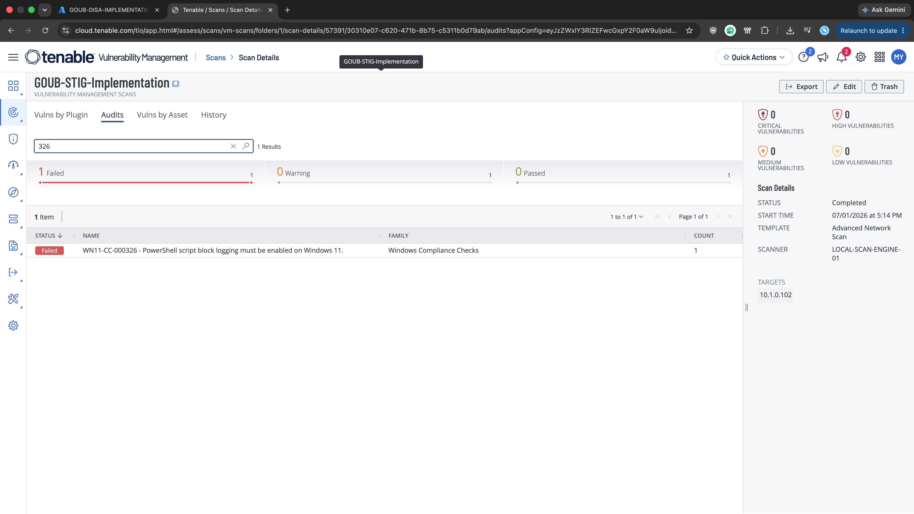
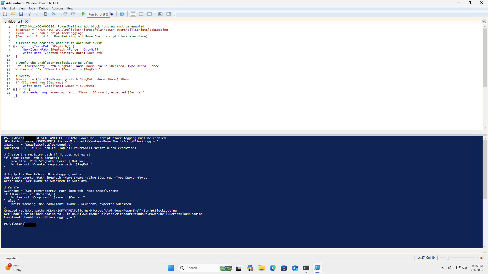
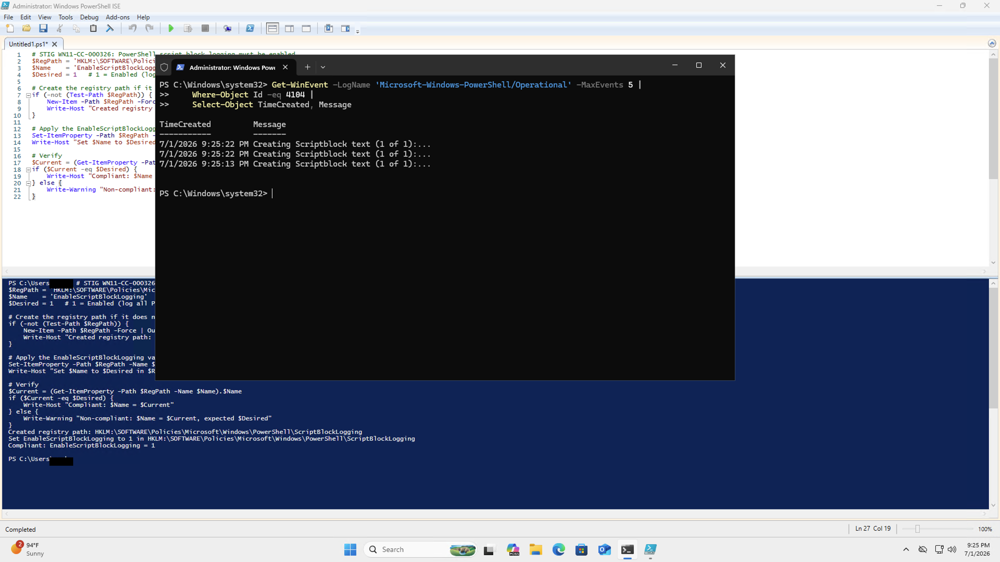

# Windows 11 STIG 07: V-253414 (WN11-CC-000326)

**Status:** Published
**STIG:** DISA Microsoft Windows 11 Security Technical Implementation Guide v2r7
**Finding:** V-253414 (WN11-CC-000326)

Part of the [DISA STIG Implementation with PowerShell](https://github.com/goubx/DISA-STIG-Implementation-w-PowerShell-series-) series.

---

## Overview

This entry hardens a stock Azure Windows 11 VM against one finding from the DISA Microsoft Windows 11 STIG v2r7 using PowerShell. The workflow:

1. Scan an unhardened Azure VM with Tenable's DISA STIG compliance audit.
2. Pick a failed finding from the Audit tab.
3. Remediate it manually to confirm the fix path.
4. Translate that fix into an idempotent PowerShell function.
5. Rescan to confirm the finding moves to passed.

Registry-based finding under `HKLM:\SOFTWARE\Policies\Microsoft\Windows\PowerShell\ScriptBlockLogging`. The manual fix is a single GPO toggle; the PowerShell equivalent is a short `Set-ItemProperty` script. This finding is a little different from a typical registry hardening item because the point of the setting is to generate a log stream, so post-remediation validation also involves confirming that Event ID 4104 records are actually being written.

---

## Target Platform

| Field            | Value                          |
|------------------|--------------------------------|
| OS               | Windows 11 Pro                 |
| Azure VM         | Standard                       |
| Private IP       | 10.1.0.102                     |
| Domain joined    | No                             |

---

## Tools Used

| Tool                          | Purpose                                       |
|-------------------------------|-----------------------------------------------|
| Tenable Nessus                | Scanning with the DISA STIG audit             |
| Windows PowerShell ISE        | Remediation engine                            |
| Local Group Policy Editor     | Manual remediation pass                       |
| Registry Editor               | State verification before and after the fix   |
| Windows Event Log             | Post-remediation proof (Event ID 4104)        |
| STIG-A-View                   | Finding reference (Check + Fix text)          |
| Azure                         | Lab VM hosting                                |

---

## Lab Setup

The lab uses a stock Azure Windows 11 VM with Windows Defender Firewall disabled so the Tenable scanner can reach the host across the lab network:


> Note: this is a lab-only step. In production you would scope firewall rules to permit the scan engine rather than disabling the firewall outright.

---

## Scan Configuration

The Tenable scan that produced this finding uses the Advanced Network Scan template, configured once and reused across all findings in this series:

1. **Scans, Create Scan, Advanced Network Scan**
2. Name: `GOUB-STIG-IMPLEMENTATION`
3. Target: the VM's private IP (`10.1.0.102`)
4. Scanner: internal scan engine
5. Credentials: local administrator on the VM

### Compliance audit

Under the Compliance tab, the DISA Microsoft Windows 11 STIG v2r7 audit is added:


### Plugin scoping

To keep the scan fast and focused on STIG findings only, every plugin family is disabled except one:

1. Plugins, filter for `policy`, enable **Policy Compliance**.
2. Inside Policy Compliance, enable only **Windows Compliance Checks** (Plugin ID 21156).


---

## Initial Scan

The scan against the Azure VM returned 147 failed audits out of 263 total checks. STIG findings on a default Windows 11 image are dense, which makes this a good source of remediation work.

The finding this repo documents:

> **WN11-CC-000326** : PowerShell script block logging must be enabled on Windows 11.

Without this control, PowerShell activity on the host is largely invisible. Attackers routinely obfuscate their PowerShell payloads (Base64, string concatenation, invoke-expression chains) specifically to avoid signature-based detection, and script block logging is the log source that captures the deobfuscated form of what actually ran. No script block logs, no forensic trail for PowerShell-based attacks.

---

## Finding Details

Pulled from the STIG-A-View entry and cross-checked against the Tenable audit detail:

| Field            | Value                          |
|------------------|--------------------------------|
| STIG ID          | WN11-CC-000326                 |
| Vulnerability ID | V-253414                       |
| Severity         | Medium (CAT II)                |
| CCI              | CCI-000135                     |
| Rule ID          | SV-253414r958422_rule          |





**Why it matters:** Script block logging records the full, deobfuscated text of every PowerShell script block as it executes, and writes each one to the `Microsoft-Windows-PowerShell/Operational` event log under Event ID 4104. That means even if an attacker delivers a heavily obfuscated command, the log captures the version that PowerShell actually ran, which is what a defender needs for detection and forensics. Without this setting, PowerShell-based intrusions leave almost no useful trail.

**Fix per DISA:**
> Configure the policy value for Computer Configuration > Administrative Templates > Windows Components > Windows PowerShell > "Turn on PowerShell Script Block Logging" to "Enabled".

Translated to the registry:

| Field         | Value                                                                             |
|---------------|-----------------------------------------------------------------------------------|
| Hive          | HKEY_LOCAL_MACHINE                                                                |
| Path          | `\SOFTWARE\Policies\Microsoft\Windows\PowerShell\ScriptBlockLogging`              |
| Value Name    | EnableScriptBlockLogging                                                          |
| Value Type    | REG_DWORD                                                                         |
| Value Data    | 0x00000001 (1)                                                                    |

---

## Step 1: Manual Remediation

Before touching anything, I opened Registry Editor (`regedit.exe`) and navigated to `HKLM\SOFTWARE\Policies\Microsoft\Windows\` to confirm the current state. There was no `PowerShell` subkey at all, so the `ScriptBlockLogging` key and its `EnableScriptBlockLogging` value definitely did not exist:



Missing key = the check fails, which matches what Tenable reported.

Opened Local Group Policy Editor (`gpedit.msc`) and navigated to:

> Computer Configuration > Administrative Templates > Windows Components > Windows PowerShell

Then set **"Turn on PowerShell Script Block Logging"** to **Enabled**:



Back in Registry Editor, the `PowerShell\ScriptBlockLogging` key now exists and holds an `EnableScriptBlockLogging` DWORD set to `0x00000001`, confirming the GPO push landed at the registry level:



After rerunning the Tenable scan, the finding passes:



The manual fix works. Now to translate it into a script.

---

## Step 2: Capture the Registry Export

The correct registry state, after the GPO change, is:

```reg
Windows Registry Editor Version 5.00

[HKEY_LOCAL_MACHINE\SOFTWARE\Policies\Microsoft\Windows\PowerShell\ScriptBlockLogging]
"EnableScriptBlockLogging"=dword:00000001
```

That tells the script exactly what to produce: the `PowerShell\ScriptBlockLogging` key under `Policies\Microsoft\Windows`, a DWORD named `EnableScriptBlockLogging`, and the value `0x00000001`.

---

## Step 3: Revert and Re-verify

I reverted the Group Policy setting back to "Not Configured" and reran the scan. The finding is failed again, as expected:



Now there's a clean baseline to validate the script against.

---

## Step 4: PowerShell Remediation

```powershell
function Set-StigRule-V253414 {
    <#
    .SYNOPSIS
        V-253414: PowerShell script block logging must be enabled on Windows 11.

    .DESCRIPTION
        Severity:        CAT II (Medium)
        STIG ID:         WN11-CC-000326
        CCI:             CCI-000135
        Tenable Plugin:  Windows Compliance Checks (21156)
        Reference:       DISA Microsoft Windows 11 STIG v2r7

        Enables PowerShell script block logging so that every script block
        PowerShell executes is written to the Microsoft-Windows-PowerShell
        /Operational event log under Event ID 4104. Sets
        EnableScriptBlockLogging to 1 under the ScriptBlockLogging policy
        key, which is the registry change Group Policy makes when enabling
        "Turn on PowerShell Script Block Logging".

    .EXAMPLE
        Set-StigRule-V253414
    #>
    [CmdletBinding(SupportsShouldProcess)]
    param()

    $RegPath = 'HKLM:\SOFTWARE\Policies\Microsoft\Windows\PowerShell\ScriptBlockLogging'
    $Name    = 'EnableScriptBlockLogging'
    $Desired = 1   # 1 = Enabled (log all PowerShell script block execution)

    # Create the registry path if it does not exist
    if (-not (Test-Path $RegPath)) {
        New-Item -Path $RegPath -Force | Out-Null
        Write-Host "Created registry path: $RegPath"
    }

    # Apply the EnableScriptBlockLogging value
    Set-ItemProperty -Path $RegPath -Name $Name -Value $Desired -Type DWord -Force
    Write-Host "Set $Name to $Desired in $RegPath"

    # Verify
    $Current = (Get-ItemProperty -Path $RegPath -Name $Name).$Name
    if ($Current -eq $Desired) {
        Write-Host "Compliant: $Name = $Current"
    } else {
        Write-Warning "Non-compliant: $Name = $Current, expected $Desired"
    }
}
```

What it does, in order:

1. **Check path.** `Test-Path` confirms whether the `ScriptBlockLogging` policy key exists.
2. **Create if missing.** `New-Item -Force` creates the key and any missing parents (including the `PowerShell` subkey that also has to be created on a clean image).
3. **Set the value.** `Set-ItemProperty` writes `EnableScriptBlockLogging` as a DWord with the desired data (1).
4. **Verify.** Reads the value back and emits a Compliant or Non-compliant line.

Running it from an elevated PowerShell ISE session against the reverted baseline:



Output:

```
Created registry path: HKLM:\SOFTWARE\Policies\Microsoft\Windows\PowerShell\ScriptBlockLogging
Set EnableScriptBlockLogging to 1 in HKLM:\SOFTWARE\Policies\Microsoft\Windows\PowerShell\ScriptBlockLogging
Compliant: EnableScriptBlockLogging = 1
```

### Post-remediation proof: Event ID 4104

Passing the STIG check only proves the registry value is correct. It does not prove the log stream that the setting is supposed to produce is actually flowing. To confirm end-to-end, I queried the operational log for Event ID 4104 records:

```powershell
Get-WinEvent -LogName 'Microsoft-Windows-PowerShell/Operational' -MaxEvents 5 |
    Where-Object Id -eq 4104 |
    Select-Object TimeCreated, Message
```



Three `Creating Scriptblock text` events came back with timestamps from immediately after the script ran, confirming that PowerShell is actually writing script block logs, not just holding a registry value that says it should.

---

## Step 5: Final Validation

After rerunning the same Tenable scan, the finding passes:


---

## Result

| Stage                        | WN11-CC-000326 |
|------------------------------|----------------|
| Initial scan                 | Failed         |
| After manual remediation     | Passed         |
| After reverting              | Failed         |
| After PowerShell remediation | Passed         |

The finding was cleared both by hand and programmatically, with the scan-pass state proven against a clean baseline both times, and the underlying log stream proven with Event ID 4104 records.

---

## Notes

### Operational impact
Script block logging writes every script block PowerShell executes to the operational event log. On workstations that run a lot of PowerShell (login scripts, admin tools, agent frameworks), this can produce a meaningful volume of Event ID 4104 records, so downstream log shipping and retention should account for it. In practice this is the point: without the log, PowerShell-based attacker activity leaves no forensic trace.

### Registry key had to be created
On the baseline VM the entire `PowerShell` subkey (and therefore `ScriptBlockLogging` below it) did not exist under `Policies\Microsoft\Windows`, so both the GPO push and the script had to create the full path before writing the value. `New-Item -Force` handles missing parent keys in a single call, which is why the script does not need a separate step for the intermediate `PowerShell` key.

### Registry compliance vs actual log flow
This finding is a good example of why "check passed" is not the same as "control working". A misconfigured Windows event log service, a broken forwarder, or a downstream retention policy could all render script block logging useless even with the registry value set correctly. The Event ID 4104 verification in Step 4 catches that gap; the STIG check itself does not.

---

## References

- [DISA STIG Library](https://public.cyber.mil/stigs/)
- [STIG-A-View entry for V-253414](https://www.stigaview.com/products/windows-11/v2r7/V-253414/)
- [Tenable Plugin Database](https://www.tenable.com/plugins/search)
- [Microsoft: PowerShell Script Block Logging](https://learn.microsoft.com/en-us/powershell/module/microsoft.powershell.core/about/about_logging_windows)
